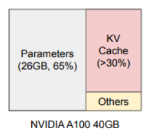
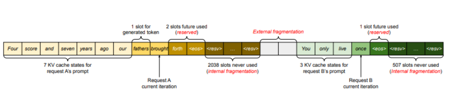
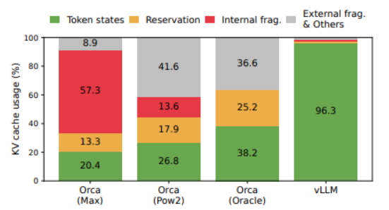
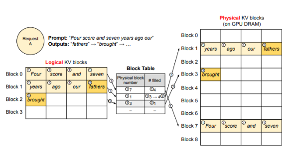

# vLLM
(https://blog.vllm.ai/2023/06/20/vllm.html)

## 핵심

> **Paged Attention**을 이용하여 LLM serving에서 sota system(FT, Orca)들과 비교했을 때, 같은 수준의 latency를 유지하면서 throughput을 2~4배 향상 시킨 방법론이다.

---

## LLM inference 특징

- 기존 LLM 서빙은 한번에 하나의 token밖에 생성하지 못하므로 iterative
- token을 생성하고 끝날 때까지 기다리는 것을 반복하는 건 GPU 연산 능력을 제대로 활용하지 못하고 throughput을 저하시키는 memory-bound 현상
- 많은 request를 하나의 batch로 묶어서 throughput을 향상시킬 수 있고, 이를 위해 GPU memory를 효율적으로 관리가 필요

- 13B의 파라미터를 가진 모델을 A100(40GB)에 사용할 때, 할당되는 GPU memory를 주목해보자
- Parameters는 inference 동안 static한 부분이므로 어떻게 할 수 없다.
- KV Cache 부분은 request에 따라 dynamic하게 활용되므로 해당 부분을 활용하자.

---

## 기존 KV cahce 방법과 문제점

- 기존 방식들은 request에 대한 KV cache를 물리적으로 연속된 하나의 memory 공간에 저장
- memory 공간은 대부분 생성가능한 최대 길이로 할당
- KV cache는 모델이 생성하는 새로운 토큰에 따라 길이가 가변적으로 예측불가능하여 미리 최대 길이로 할당

### 문제점 1 : internal/external memory fragmentation

- 예측 불가능하기 때문에 사전에 물리적으로 인접한 최대 길이의 공간을 할당
- 여기서 fragmentation은 internal fragmentation, external fragmentation, reserved으로 분리

1. internal fragmentation  
최대 길이에 도달하기 전에 생성이 완료되어, k,v cache가 이뤄지지 않은 공간  
(2048 할당 -> 10 사용 -> 2038 not use)

2. external fragmentation  
각 request 마다 할당 공간이 다르기 때문에 생기는 할당 공간끼리의 비어있는 공간

3. reserved  
실제로 생성에 사용되는 공간  
만약 생성될 길이가 1000이라고 가정했을 때, 첫번째 iteration에는 1개의 공간만 필요하고 나머지 999개는 사용되지 않으니 비효율적

- 현재 사용되는 시스템에서 GPU memory는 20~40% 밖에 사용하고 있지 않다. (vLLM 제외)

### 문제점 2 : memory 공유 불가

- decoding 방법 중 하나의 request에 대해서 다수의 output을 생성하는 방법들이 다양하다.
- KV cache도 어느 정도는 공유할 수 있는 부분이 있을텐데, 분리된 연속된 공간에 존재하기에 KV cache의 공유가 불가능하다.

---

## Paged Attention

기존 방식의 두 가지 한계를 해결하기 위해 고안한 attention 방식(memory fragmentation and sharing: virtual memory with paging 방식에서 영감)

- KV cache를 여러 Phycial KV block 으로 분산
- 각 Phycial KV block 은 일정 개수의 토큰의 key, value 저장(개수 조절 가능)
- Phycial KV block 은 물리적으로 인접할 필요 없음
- Phycial KV block 들이 어디에 위치하고, 블록의 순서와 블록에 몇 개의 값이 저장되어 있는지 기록한 Block Table 존재

1. 위와 같은 방식을 사용하여 필요할 때만 dynamic하게 memory를 할당하여 쓰므로 interenal fragmentation, reserved의 낭비 감소
2. 모든 블록이 같은 크기를 가져서 external fragmentation 감소
3. block 단위로 저장되기 때문에 메로리 공유 가능

---

## 정리

- PagedAttention 기반의 high-throughput distributed LLM serving engine
- PagedAttention을 통해 KV cache 메모리의 낭비가 0에 근사
- PagedAttention 과 같이 디자인된, block-level memory management와 preemptive request scheduling을 사용
- PagedAttention 은 batch를 키워서 throughput을 높였지만 실제 단일 inference 속도는 변화 없음
- GPT, LLaMA와 같은 널리 사용되는 LLM 지원
- 하나의 GPU에 담을 수 없는 크기도 지원
- 정확도의 손해 없이 sota system 보다 2-4X의 serving throughput 달성
- 특히 모델이 클수록, seq length가 길수록, decoding 방법이 복잡할 수록 좋은 성능 향상
- 캐싱을 통한 재계산 낭비를 줄이고, GPU 뿐만 아니라 CPU 메모리도 같이 활용하여 캐싱을 사용
- Prompt 길이를 1-shot 보다 5-shot으로 길게 가져가면, 캐싱을 더욱 많이 활용하기 때문에 더 큰 효과 발휘

---