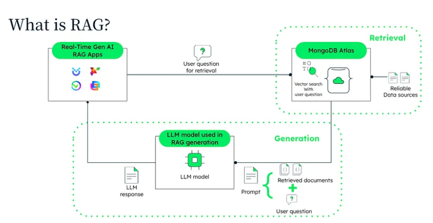
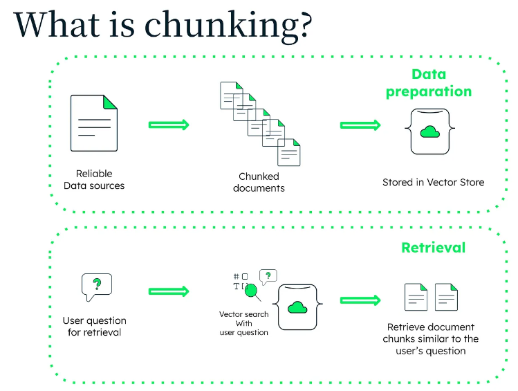
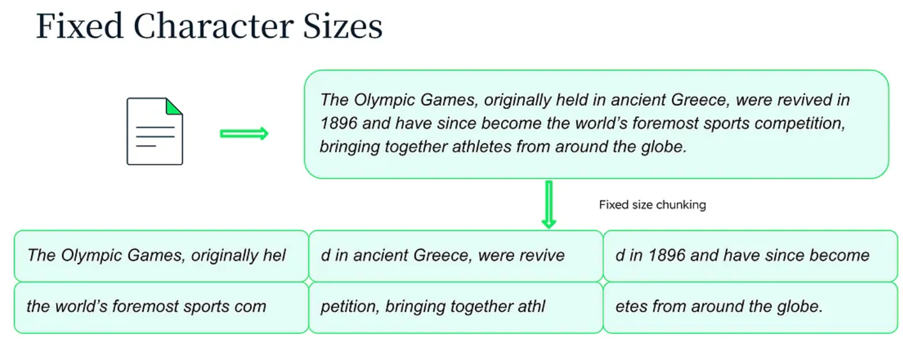
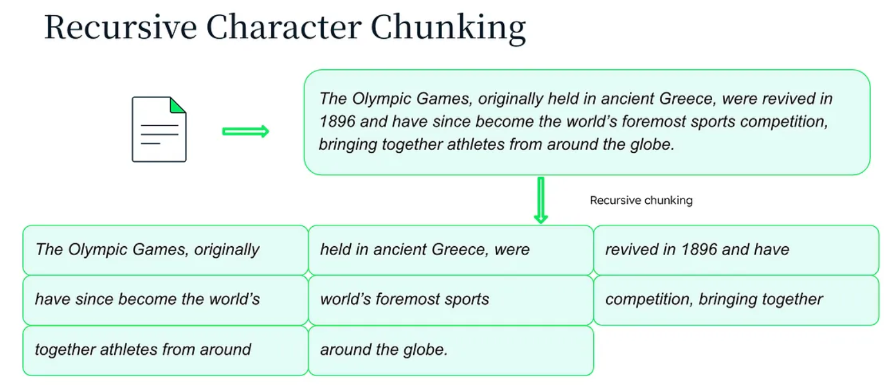
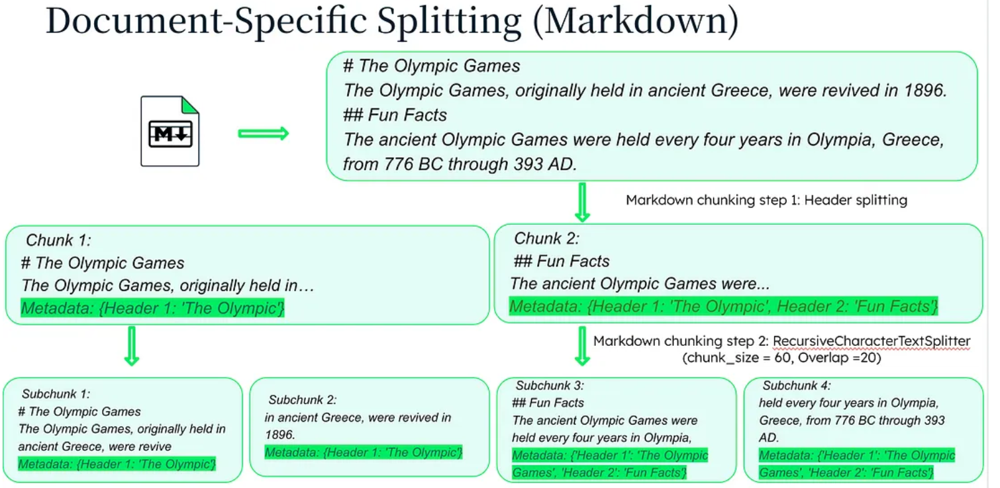
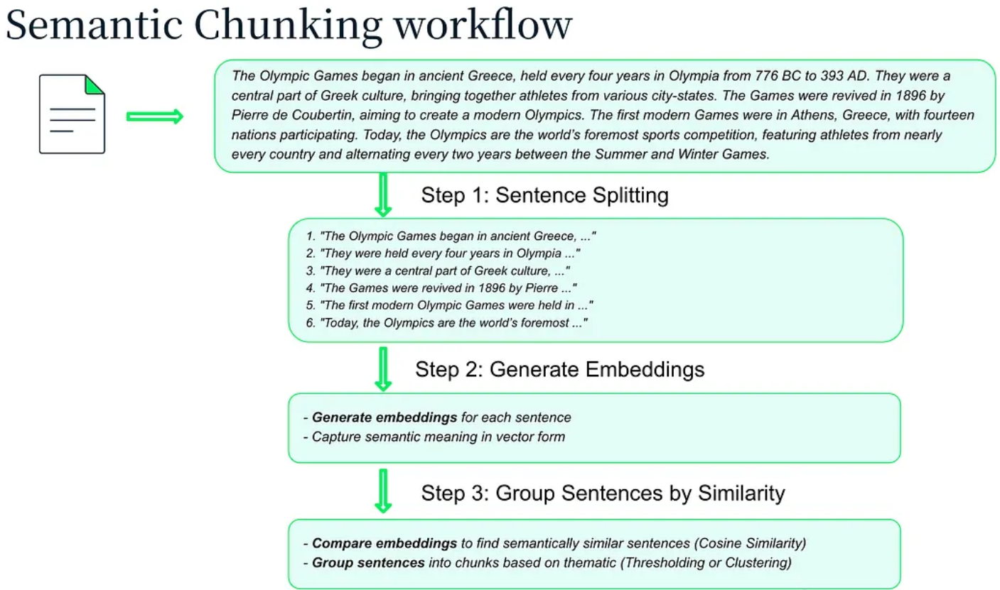
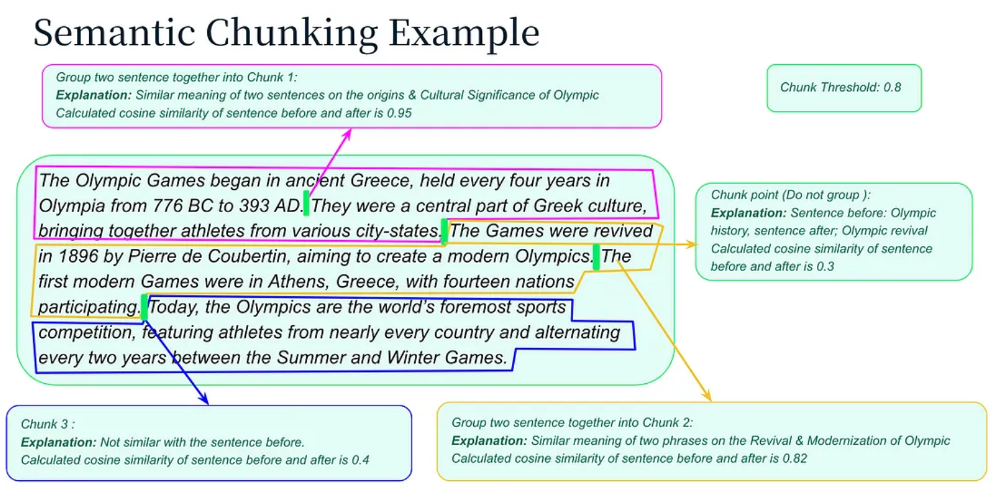
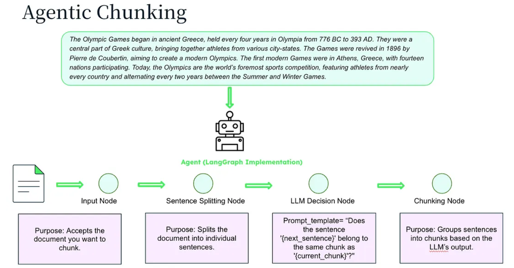

# Chunking Strategy : RAG에서의 AI 성능 향상

## 목차

1. [RAG?](#rag)
2. [Chunking?](#chunking)
3. [RAG에서 Chunking의 중요성](#rag에서-chunking의-중요성)
4. [Chunking Strategy](#chunking-strategy)
5. [Fixed Character Chunking](#fixed-character-chunking)
6. [Recursive Character Chunking](#recursive-character-chunking)
7. [Document-Specific Chunking](#document-specific-chunking)
8. [Semantic Chunking](#semantic-chunking)
9. [Agentic Chunking](#agentic-chunking)
10. [정리](#정리)

## RAG?



- RAG는 검색 매커니즘을 LLM 모델과 통합하는 접근 방식이다.
- 검색된 문서를 사용하여 AI 기능을 강화하고, 더 정확하고 맥락적으로 풍부한 응답을 생성한다.

## Chunking?



- Chunking은 큰 텍스트 조각을 더 작고 관리하기 쉬운 청크로 나누는 것이다.
- 해당 프로세스는 아래와 같은 2가지 중요한 프로세스가 있다.

1. **Data preparation** : 데이터 소스는 청크 문서로 세분화되어 데이터베이스에 저장된다. 청크 내에 임베딩을 생성하는 경우 데이터베이스는 벡터 스토어가 될 수 있다.
2. **Retrieval** : 사용자가 질문을 하면 시스템은 벡터 검색, 전체 텍스트 검색 또는 두 가지 조합을 사용하여 문서 청크를 검색한다. 해당 프로세스는 사용자의 질의와 가장 관련성의 높은 청크를 식별하여 검색한다.

## RAG에서 Chunking의 중요성

1. **청크가 작으면 정확도 향상** : 청킹을 통해 더 작은 텍스트 세그먼트를 색인하고 검색할 수 있어 관련 문서를 찾는 정확도가 높아진다.
2. **청크가 크면 문맥적 생성 향상** : 모델이 크고 나뉜 문서를 걸러내는 대신 구체적이고 관련성 있는 정보를 활용할 수 있으므로 더 일관되고 문맥적으로 정확한 응답을 제공한다.
3. **확장성 및 성능** : 대용량 데이터를 관리하기 쉬운 조각으로 나누어 병렬로 처리함으로써 계산 부하를 줄이고 RAG의 전반적인 성능을 향상시킨다.

- RAG 시스템에서 적절한 Chunking Size를 설정하는 것이 매우 중요하다

## Chunking Strategy

1. **Fixed Character Sizes** : 간단하고, 직관적이며, 텍스트를 고정된 개수의 문자 단위로 나누는 방식
2. **Recursive Character Text Splitting** : 공백이나 구두점과 같은 구분 기호를 사용하여 문맥적으로 더 의미 있는 chunk를 만드는 방식
3. **Document-Specific Splitting** : PDF나 Markdown 파일과 같은 문서 유형에 맞게 chunk 분할 방법을 조정하는 방식
4. **Semantic Splitting** : 임베딩을 사용하여 의미적 내용에 따라 텍스트를 분할하는 방식
5. **Agentic Splitting** : LLM을 활용하여 콘텐츠와 맥락에 따라 최적의 Chunking을 결정하는 방식

## Fixed Character Chunking

- 내용에 관계없이 텍스트를 미리 정해진 문자 수의 청크로 나는 것
- 간단하지만 텍스트의 구조와 맥락을 고려하지 않아 의미 없는 청크 생성
- 더 정교한 방법으로 넘어가기 전, 자주 사용



### 장점

- 단순성 : 구현하기 쉽고 최소한의 컴퓨팅 리소스가 필요
- 일관성 : 균일한 청크를 생성하여 다운스트림 처리를 간소화

### 단점

- 맥락 무시 : 텍스트의 구조와 이미를 무시하여 정보가 단편화
- 비효율성 : 중요한 맥락이 차단되어 의미 있는 정보를 다시 만들기 위하 추가 처리가 필요

### 예시

```python
text = "안녕하세요. 청킹을 위한 테스트 코드입니다. 응용하여 자신의 프로젝트에 적용시키세요."

# 청크 사이즈 세팅
chunk_size = 35
chunks = []
# 청크 사이즈에 맞게 chunking 추가
for i in range(0, len(text), chunk_size):
    chunk = text[i:i + chunk_size]
    chunks.append(chunk)
# 청크 출력
print(chunks)
```

- Langchain의 CharacterTextSplitter 사용

```python
from langchain.text_splitter import CharacterTextSplitter

text = "안녕하세요. 청킹을 위한 테스트 코드입니다. 응용하여 자신의 프로젝트에 적용시키세요."

# 청크 사이즈 세팅 후 text_splitter 객체 초기화
text_splitter = CharacterTextSplitter(chunk_size=35, chunk_overlap=0, separator='', strip_whitespace=False)
# text_splitter 사용하여 documents 객체 생성
documents = text_splitter.create_documents([text])
# chunking된 문서 내용 출력
for doc in documents:
    print(doc.page_content)
```

## Recursive Character Chunking

- 일련의 구분 기호(, . etc)를 사용하여 텍스트를 청크로 재귀적으로 나누는 것
- 청크가 더 의미 있고 문맥적으로 관련성이 있도록 함
- 단순성과 정교함의 균형을 이루며, 텍스트의 고유한 구조를 존중하는 견고한 청킹 방법을 제공



### 장점

- 개선된 맥락 : 문단이나 문장에 구분 기호를 사용하여 텍스트의 자연스러운 구조를 보존
- 유연성 : 다양한 청크 크기와 겹침을 허용하여 청크 분할 프로세스를 효과적으로 제어 가능

### 단점

- 청크 크기 중요 : 하나 이상의 구문을 포함해야 하기 때문에, 청크 크기를 설정하는 것이 중요
- 성능 오버헤드 : 재귀적 분할과 여러 구분 기호 처리로 인해 더 많은 계산 리소스가 필요

### 예시

```python
from langchain_text_splitters import RecursiveCharacterTextSplitter 
# 청크로 변환할 샘플 텍스트
text = """ 
원래, 고대 그리스에서 열렸던 올림픽은, 1896년에 부활하여, 전 세계의 선수들이 모이는 세계 최고의 스포츠 경기가 되었습니다. """ 

# 지정된 청크 크기로 재귀적 문자 텍스트 분할기를 초기화
text_splitter = RecursiveCharacterTextSplitter( 
    # 표시하기 위해 정말 작은 청크 크기를 설정
    chunk_size= 30, 
    chunk_overlap= 20, 
    # 텍스트 길이로 계산 파라미터
    length_function= len, 
    # 구분자로 정규식 사용 여부 파라미터
    is_separator_regex= False, 
) 
# 텍스트 분할기를 사용하여 문서 만들기
documents = text_splitter.create_documents([text]) 
# 생성된 문서 표시 
for doc in documents: 
    print (doc.page_content)

```

## Document-Specific Chunking

- Markdown 파일, Python 스크립트, JSON 문서 또는 HTML 등의 다양한 문서 유형에 맞게 Chunking 프로세스를 조정하여 콘텐츠와 구조에 가장 적합하게 분할하는 것
- 해당 예시에는 Markdown을 예로 듬



### 장점

- 연관성 : 다양한 문서 유형은 가장 적절한 방법을 사용하여 분할되며 논리적 구조가 유지
- 정확도 : 각 문서 유형의 고유한 특성에 맞춰 청킹 프로세스를 조정

### 단점

- 복잡한 구현 : 다양한 문서 유형에 대해 서로 다른 청킹 전략과 라이브러리가 필요
- 유지관리 : 유지관리의 다양한 방법으로 인해 더욱 복잡

### 예시

```python
from langchain.text_splitter import MarkdownTextSplitter

# 마크다운 텍스트 샘플
markdown_text = """ 
# 캘리포니아에서의 재미 
## 운전 
1번 고속도로에서 샌디에이고까지 운전해보세요 
### 음식 
그곳에 있는 동안 꼭 부리또를 먹어보세요 
## 하이킹 
요세미티로 가보세요 
""" 
# 마크다운 텍스트 분할기 초기화
splitter = MarkdownTextSplitter(chunk_size= 40 , chunk_overlap= 0 ) 
# 텍스트 분할기를 사용하여 문서 만들기
documents = splitter.create_documents([markdown_text]) 
# 생성된 문서 표시 
for doc in documents: 
    print (doc.page_content) 
```

- 파이썬 코드 분할

```python
from langchain.text_splitter import PythonCodeTextSplitter

# 샘플 Python 코드
python_text = """ 
class Person: 
    def __init__(self, name, age): 
        self.name = name 
        self.age = age 
p1 = Person("John", 36) 
for i in range(10): 
    print(i) 
""" 
# Python 코드 텍스트 분할기를 초기화
python_splitter = PythonCodeTextSplitter(chunk_size= 100 , chunk_overlap= 0 ) 
# 텍스트 분할기를 사용하여 문서 만들기
documents = python_splitter.create_documents([python_text]) 
# 생성된 문서를 표시
for doc in documents: 
    print (doc.page_content) 
```

## Semantic Chunking

- Semantic Chunking은 텍스트의 의미를 사용하여 청크 경계를 결정
- 이 방법은 임베딩을 활용하여 의미적으로 유사한 컨텐츠를 그룹화하고 각 청크에 문맥적으로 일관된 정보를 포함



- 위 다이어그램은 Semantic Chunking Workflow를 보여준다.
- 문장 분할 -> 임베딩 생성 -> 유사성에 따라 문장을 그룹화
- 해당 프로세스는 청크가 의미적으로 일관성이 있도록 보장하여 정보 검색의 관련성과 정확성을 향상



- 위 다이어그램은 코사인 유사도를 사용하여 문장을 청크로 그룹화하는 방법에 대한 실제적인 예를 제공

### 장점

- 문맥적 연관성 : 청크에 의미적으로 유사한 콘텐츠가 포함되어 있는지 확인하여 정보 검색 및 생성의 정확성 향상
- 동적 적응성 : 엄격한 규칙이 아닌 의미에 따라 다양한 텍스트 구조와 콘텐츠 유형에 적응 가능

### 단점

- 계산 오버헤드 : 임베딩을 생성하고 비교하는데 추가적인 계산 리소스가 필요
- 복잡성 : 간단한 분할 방법에 비해 구현이 더 복잡

### 예시

```python
from sklearn.metrics.pairwise import cosine_similarity
from langchain.embeddings import OpenAIEmbeddings
import re
import numpy as np

# 샘플 텍스트
text = """
One of the most important things I didn't understand about the world when I was a child is the degree to which the returns for performance are superlinear.
Teachers and coaches implicitly told us the returns were linear. "You get out," I heard a thousand times, "what you put in." They meant well, but this is rarely true. If your product is only half as good as your competitor's, you don't get half as many customers. You get no customers, and you go out of business.
It's obviously true that the returns for performance are superlinear in business. Some think this is a flaw of capitalism, and that if we changed the rules it would stop being true. But superlinear returns for performance are a feature of the world, not an artifact of rules we've invented. We see the same pattern in fame, power, military victories, knowledge, and even benefit to humanity. In all of these, the rich get richer.
"""

# 텍스트를 문장으로 분할
sentences = re.split(r'(?<=[.?!])\s+', text)
sentences = [{'sentence': x, 'index' : i} for i, x in enumerate(sentences)]

# 문맥에 맞게 문장 결합하는 함수
def combine_sentences(sentences, buffer_size=1):
    for i in range(len(sentences)):
        combined_sentence = ''
        for j in range(i - buffer_size, i):
            if j >= 0:
                combined_sentence += sentences[j]['sentence'] + ' '
        combined_sentence += sentences[i]['sentence']
        for j in range(i + 1, i + 1 + buffer_size):
            if j < len(sentences):
                combined_sentence += ' ' + sentences[j]['sentence']
        sentences[i]['combined_sentence'] = combined_sentence
    return sentences

sentences = combine_sentences(sentences)

# 임베딩 모델 생성
oai_embeds = OpenAIEmbeddings()
embeddings = oai_embeds.embed_documents([x['combined_sentence'] for x in sentences])

# 문장에 임베딩 추가
for i, sentence in enumerate(sentences):
    sentence['combined_sentence_embedding'] = embeddings[i]

# 코사인 거리 계산 함수
def calculate_cosine_distances(sentences):
    distances = []
    for i in range(len(sentences) - 1):
        embedding_current = sentences[i]['combined_sentence_embedding']
        embedding_next = sentences[i + 1]['combined_sentence_embedding']
        similarity = cosine_similarity([embedding_current], [embedding_next])[0][0]
        distance = 1 - similarity
        distances.append(distance)
        sentences[i]['distance_to_next'] = distance
    return distances, sentences

distances, sentences = calculate_cosine_distances(sentences)

# 중단점을 결정하고 청크 생성
breakpoint_distance_threshold = np.percentile(distances, 95)
indices_above_thresh = [i for i, x in enumerate(distances) if x > breakpoint_distance_threshold]

# 문장을 청크로 결합
chunks = []
start_index = 0
for index in indices_above_thresh:
    end_index = index
    group = sentences[start_index:end_index + 1]
    combined_text = ' '.join([d['sentence'] for d in group])
    chunks.append(combined_text)
    start_index = index + 1

if start_index < len(sentences):
    combined_text = ' '.join([d['sentence'] for d in sentences[start_index:]])
    chunks.append(combined_text)

# 청크 출력
for i, chunk in enumerate(chunks):
    print(f"Chunk #{i+1}:\n{chunk}\n")
```

## Agentic Chunking

- LLM 힘을 활용하여 텍스트의 의미적 이해에 따라 동적으로 청크 생성하는 것
- 최적의 청크 경계를 결정하기 위해 콘텐츠와 맥락을 평가하여 청크 분할에 대한 인간의 접근 방식을 모방
- 사전 정의된 규칙이나 순전히 통계적 방법에 의존 X



### 장점

- 높은 정확도 : 정교한 언어 모델을 사용하여 매우 관련성 있고 상황에 맞는 정확한 정보 제공
- 적응성 : 다양한 유형의 텍스트를 처리하고 즉석에서 청킹 전략 조정

### 단점

- 많은 리소스가 필요하고 추가 LLM 비용이 발생
- 복잡한 구현 : 최적의 성능을 위한 언어 모델 성정과 미세 조정 작업 수행

### 간단하게 LangGraph에서 Agentic Splitter 구현

- LangGraph의 노드는 workflow의 작업 또는 단계를 나타냄.
- 각 노드는 입력을 받고, 처리하고, 다음 노드로 전달되는 출력을 생성

```python
from langgraph.nodes import InputNode, SentenceSplitterNode, LLMDecisionNode, ChunkingNode

# 노드 입력
input_node = InputNode(name="Document Input")

# 문장을 노드로 분리
splitter_node = SentenceSplitterNode(input=input_node.output, name="Sentence Splitter")

# llm 결정 노드
decision_node = LLMDecisionNode(
    input=splitter_node.output, 
    prompt_template="Does the sentence '{next_sentence}' belong to the same chunk as '{current_chunk}'?", 
    name="LLM Decision"
)

# 청킹 노드
chunking_node = ChunkingNode(input=decision_node.output, name="Semantic Chunking")

document = "Your document text here..."
result = chunking_node.run(document=document)
print(result)
```

- LangGraph는 유료 프레임워크이므로 대체로 LangFuse 사용 권장
- 추후에 Agentic_Chunking 자세한 구현 정리(05. Agentic_Chunking 폴더 확인)

## 정리

- 청킹은 RAG 시스템을 최적화하는 데 필수적인 전략으로, 이를 통해 더 정확하고 상황에 적합하며 확장 가능한 응답이 가능하다.
