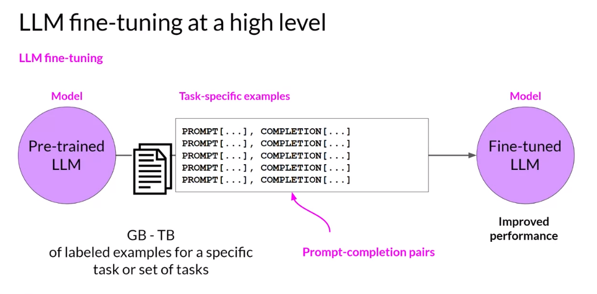
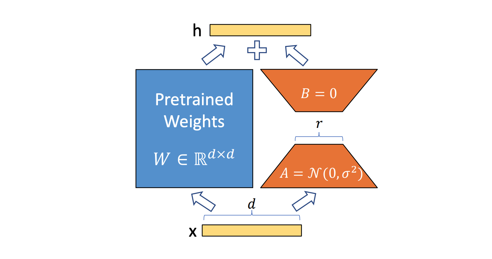
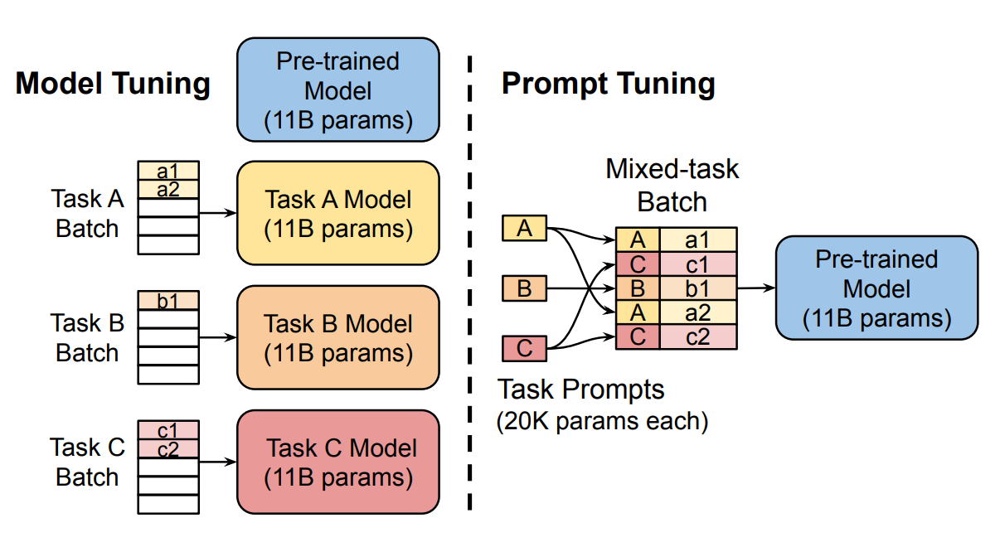
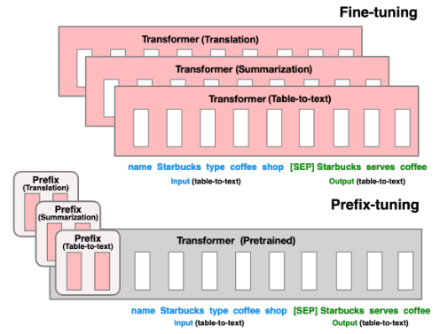
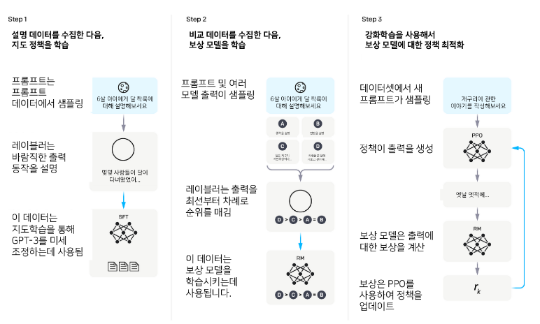
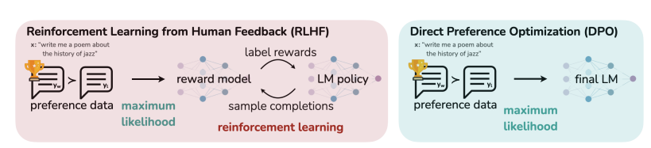

# LLM 훈련 용어 정리

## 1. Instruction fine-tuning

- LLM 모델을 Instruction 데이터셋을 통해 fine-tuning을 진행하고 이를 통해 zero-shot 성능을 높이는 방법
- 프롬프트 엔지니어링만으로 모델에게 원하는 task를 지시할 수 없을 때 사용
- Prompt와 Completion pair를 여러 개 학습시켜서, 특정 task를 잘 수행하도록 학습
- 모델의 모든 파라미터를 변경하는 full fine-tuning 방법

 

 

### 장점

1. 간단하고, 직관적이다.
2. 겪지 않은 task에 대해 일반화를 할 수 있다.

 

### 단점

1. 많은 task에 대한 데이터를 모으는 비용이 상당하다.
2. LLM의 목적과 인간 선호도간의 불일치가 발생한다.

---

## 2. PEFT(Parameter-Efficient Fine-Tuning)

- PEFT는 fine-tuning 시에 모델의 모든 파라미터를 튜닝하지 않고, 몇 개의 일부 파라미터만 fine-tuning 기법
- 다른 파라미터들은 고정시켜두고 일부 파라미터만 튜닝하기 때문에 **catastrophic forgetting** 문제가 발생할 확률 감소
- 일부의 파라미터만 조정하여 QA, Summarize, Generate PEFT 등 다양한 task에 맞는 모델로 학습 가능

catastrophic forgetting : 모델이 새로운 학습을 진행할 때에 이전에 학습한 task를 잊어버리는 문제

 

### LLM 특화 PEFT 방법론

1. Low Rank Adaptation(LoRA)

- Low-rank factorization 방법을 활용하여 LLM의 linear layer에 대한 업데이트를 근사화하는 기술
- 훈련 가능한 매개 변수의 수를 크게 줄이고 모델의 최종 성능에 거의 영향을 주지 않으면서 훈련 속도 가속

 

2. Prompt Tuning

- task별 디테일을 학습하는 훈련 가능한 tensor(Soft prompt, 소프트 프롬프트)를 모델 입력 임베딩의 맨 앞에 붙이는 방식
- task에 대한 프롬프트를 자연어로 작성하는 대신 task 수행에 최적화된 벡터를 사용(Prompt Engineering와 다른 기법)
- task에 맞게 soft prompt만 변경할 수 있는 강점

 

3. Prefix Tuning

- Prompt Tuning과 유사한 접근 방식인데, 입력 레이어에만 프롬프트 텐서를 추가하는 대신 모든 레이어의 hidden state에 학습 가능한 파라미터를 추가한다는 차이점
- 사전학습된 transformer의 다른 파라미터들은 모두 고정된 채 prefix의 파라미터만을 최적화

 

### 장점

1. 풀 파인튜닝과 유사한 성능
2. 저장공간 효뮬 및 계산 능력 상승
3. catastrophic forgetting 감소
4. low-data regime, out-of-domain scenario에서 성능 향상

 

### 단점

1. 성능 저하 가능성 존재
2. task에 따른 적합성 확인(정확한 전문 지식이 요구되는 분야)
3. 하이퍼파라미터 조정에 따른 성능 변화

---

## 3. Supervised Fine-tuning (SFT)

- 특정 도메인의 데이터 혹은 크라우드 소싱 등을 통해 구축한 양질의 (Prompt, Response) 데이터를 구축하여 fine-tuning하는 과정
- 입력 프롬프트에 대해 사람의 의도에 맞는 문장을 생성하는 방법을 학습
- 원하는 답변 형태를 잘 할 수 있도록 미리 정제되거나 레이블링한 데이터로 학습

---

#### Learning from Human Feedback 혹은 Human Preference Alignment : 긍정적/부정적 혹은 순위 정보 형식의 피드백을 주면서 사람의 선호도를 모델에 학습하는 방법론

#### 그 중 현재 가장 대표적인 방법이 Reinforcement learning from Human Feedback(RLHF)이다.

---
## 4. Reinforcement Learning from Human Feedback (RLHF)

> 강화 학습은 주어진 환경에 대해서 상태(State)에 따라 Policy 모델이 행동(Action)을 하게 되고, 그 일련의 과정으로 얻은 보상(Reward)을 기반으로 각 상태 또는 행동의 가치를 평가하여 학습하는 기계 학습 방법론이다.

- 어떤 행동이 정답인지 레이블로 존재하는 supervised learning과는 달리, 모델이 한 행동이 적절한지 아닌지를 알려줌.
- 모델이 생성한 문장에 대해서 자동으로 평가할 수 있는 리워드 모델을 학습
- 만족스럽지 못한 답변은 부정적인 보상을, 만족스러운 답변은 긍정적인 보상의 정보를 모델에 주면서 학습을 진행
- 생성(Policy), 보상(reward), 레퍼런스(reference), 비판(critic)의 4개의 모델 사용

reference 모델 : 모델의 분포로부터 너무 크게 벗어나지 않도록 방지하는 regularization term  
critic 모델 : value loss 또는 critic loss를 최소화(예측된 가치와 실제 가치(보상) 사이의 차이를 최소화) 

 

 

### 장점

1. 매우 복합적인 태스크를 단순한 피트백 태스크를 통해 해결 가능
2. 데이터 효율성이 높은 모델을 개발 가능
3. 사용자의 요구를 만족하는 다양한 답변 생성 가능

 

### 단점

1. human-in-the-loop 학습의 비용 너무 큼
2. Human preferences를 신뢰하기에는 불확실
3. Human preferences를 학습하여 예측하는 모델 또한 불확실
4. 4개의 모델을 동시에 학습하기 위해서 많은 GPU 메모리 필요

---

## 5. DPO(Direct Preference Optimization)

> RLHF의 가장 큰 단점은 ‘복잡하다’는 것이다. 이러한 이유로 복잡하고 무거운 RLHF를 대체하기 위한 방법론이 몇 가지 등장했는데, 그 중 하나가 DPO이다.
>> 그 외에 RRHF, SLiC-HF, Rejection Sampling Fine-tuning 라는 방법이 있다

- 리워드 모델을 사용하지 않고, RLHF에서 리워드 모델을 학습하는 데에 사용했던 선호도 데이터를 모델 학습에 직접 사용하는 방법
- 별도의 답변 후보들을 샘플링하는 과정이 생략되지만, 대신 학습 중에 레퍼런스 모델이 필요
- 업스테이지의 SOLAR-10.7B가 merge 기법과 DPO 방식을 사용하여 LLM을 구축
- Huggingface의 DPOTrainer를 사용하면 바로 적용 가능

 

 

### 장점

1. 별도의 보상모델을 학습할 필요 없이 언어모델을 직접 최적화
2. 보상 모델 업데이트를 통해 정책을 개선할 수 있으므로, 더 정확한 결과 추론 가능

 

### 단점

1. 보상 모델의 학습에 높은 정확성을 요구 -> 데이터의 품질과 양이 매우 중요
2. 알고리즘의 어려움(충분한 학습과 이해가 필요)

---

## 6. DAPT(Domain Adaptive Pre-Training), TAPT(Task Adaptive Pre-Training)

- 특정 domain(분야 혹은 언어도 될 수 있다)이나 task에 맞는 모델을 만들기 위해 fine-tuning이 아닌 pre-training을 이어서 한다는 뜻의 continual learning 기법
- pre-training과 동일한 훈련 방식으로 데이터셋을 추가로 학습시키는 방식
- LLM 분야에서 모델의 파라미터를 키워 거대해지는 것보다, 적절한 데이터를 추가로 훈련하는 것이 더 효과적이라는 연구가 입증

---