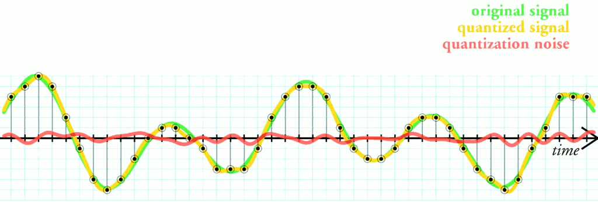
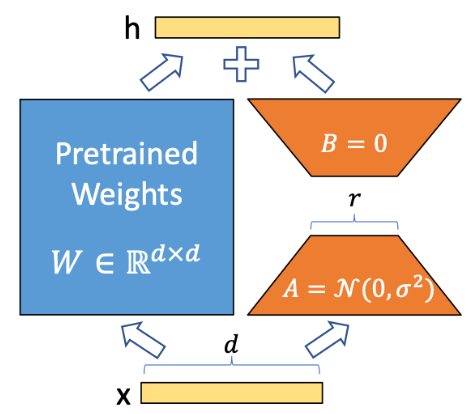

#  QLoRA (Quantized Low-Rank Adaptation)

## 개요

- 시간에 지남에 따라 LLM을 학습시키는 GPU 비용이 기하급수적으로 증가
- 비용은 커저만가고, 성능은 좋아야하니 최근 2년여 간 모델 경량화 연구에 대한 관심이 증가
- Quantization, pruning, distillation 등의 방법을 거쳐 LoRA(low-rank adaptation)나 IA3를 필두로 한 adapter 방식까지 주목
- 2023년 5월 NeurIPS에 양자화와 LoRA를 합쳐 단일 48GB GPU로 65B 모델을 튜닝할 수 있는 Quantized-LoRA, QLoRA가 발표

---

## 양자화(Quantization)

- 양자화의 사전적 정의는 '모델 가중치와 활성화 함수 출력을 더 작은 비트 단위로 표현하도록 변환'
- 쉽게 말해 데이터의 정보를 약간 줄이고 정밀도를 낮추되, 저장 및 연산하는데 필요한 용량을 감소시켜 효율성을 확보하는 경량화 방법론

 

### 양자화 방식

1. 동적 양자화 : 가중치만 미리 양자화해 활성화 함수는 추론 시에 동적으로 양자화
2. 정적 양자화 : 가중치와 활성화 함수를 모두 미리 양자화
3. 양자화-인지 훈련(quantization-aware training, QAT) : 학습 당시부터 quantization-dequantization을 반복하는 fake-quantization으로 학습 이후 수행할 양자화에 대해 미리 인지하도록 시뮬레이션

> 동적/정적 방식 모두 이미 확습이 완료된 모델을 양자화 하는거라 quantization loss와 inference latency 간의 trade-off 발생

> QAT의 경우 앞선 방식의 보완할 수 있지만, 기존 모델을 그대로 사용하지 못하고 처음부터 재학습을 해야한다는 단점 존재

- QLoRA의 저자인 Tim Dettmers는 2021년 강건성과 정밀도를 가지면서 LLM의 입력 분포 불균형 문제를 완화할 수 있는 동적 양자화 방법인 **k-bit block-wise quantization** 제안
- 하나의 배치를 블록으로 나누어 각각 quantization을 수행

---

## LoRA (Low-Rank Adaptation)

> 당시 quantization이나 distillation에 약간 밀려있는 기술인 adapter를 아주 간단하지만 혁신적으로 바꾼 경량화 방법론

- 트랜스포머 기반의 LLM은 어쨌든 임베딩을 받아 선형 변환을 하고 임베딩을 출력 -> 이미 사전 학습된 LLM의 파라미터는 업데이트하지 않고 downstream task에 필요한 파라미터를 업데이트
- 즉, 변화량만 낮은 차원의 bottle-neck으로 계산해 순전파 시 더하기

모델이 크다고 finetuning까지 꼭 무겁게 할 필요는 없다 -> 효율적이지 않다.  
LoRA는 intrinsic dimension(내제적 차원)이 낮을 것이라 가정하에 가중치 업데이트까지 low-rank decomposition으로 대체한다.

---

## QLoRA

- 기존의 LoRA에 새로운  quantization을 더한 형태
- 베이스 모델인 PLM의 가중치를 얼리고, LoRA 어댑터의 가중치만 학습 가능하게(trainable)하는 것은 LoRA와 동일
- QLoRA는 frozen PLM의 가중치가 4비트로 양자화

 

### 방법론

#### 1. 4-bit NormalFloat (NF4)

- LoRA 모델은 PLM 가중치가 4비트로 양자화된 채 저장되며, 그 데이터 타입이 바로 NormalFloat(단순 FP4, int4 타입이 아님)
- 누적 분포 함수의 quantile을 추정하는 quantile quantization 방법

#### 2. Double Quantization

- 말 그대로 한 번 양자화된 값을 한 번 더 양자화해 추가적인 메모리 이득을 보기 위한 기법
- NF4로 양자화된 가중치 자체를 한 번 더 양자화한다는 것은 아니고, 가중치를 양자화할 때 추가적으로 발생하는 값인 '양자화 상수(quantization constant)'를 양자화
- 양자화 상수는 모델 밖에 따로 저장되는 형태이고, 비율로 보자면 절대적 메모리 용량이 크지 않을 수 있지만 최대한의 효율을 위한 기법

 

#### 3. Paged Optimization

- GPU가 사용하는 VRAM 페이지를 CPU의 RAM에도 일부 저장할 수 있게 할당해주는 기술
- OOM(Out-of-Memory) 에러를 일시적으로 해결해 줄 수 있는 방법

 

## 정리

1. 기존 LoRA의 FP32 PLM + FP32 LoRA -> **NF4 PLM + BF16 LoRA**
2. 양자화가 없는 타입에서 블록 양자화 상수를 한 번 더 양자화 한 **이중 양자화**
3. VRAM 초과시 OOM 에러 발생에서 **paged optimization**을 통한 CPU RAM

---